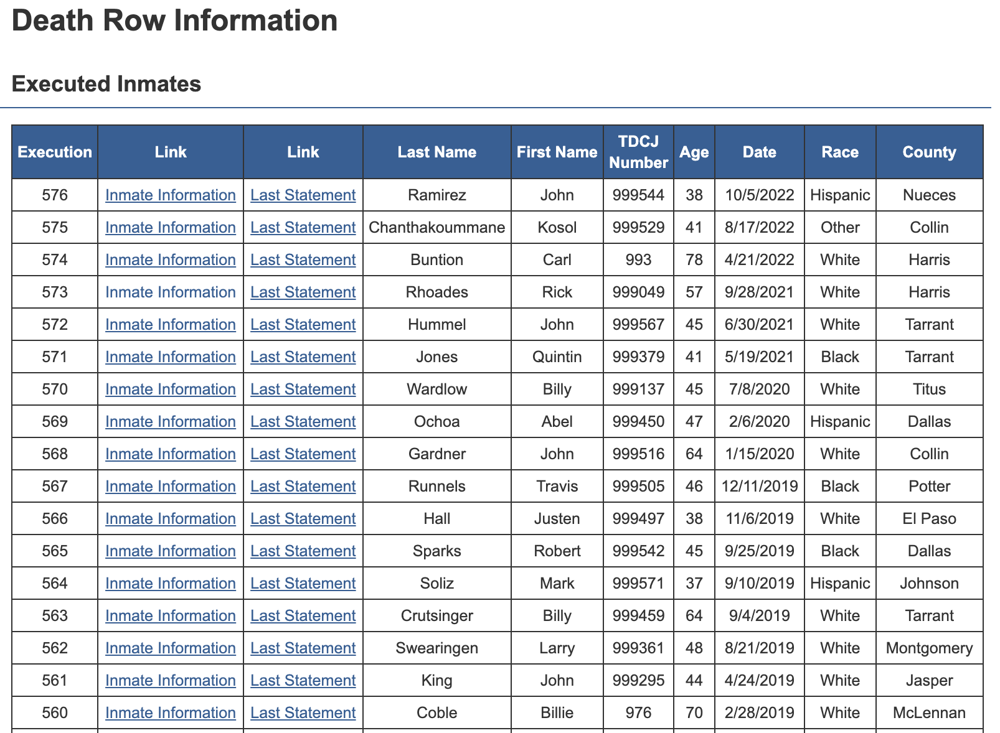
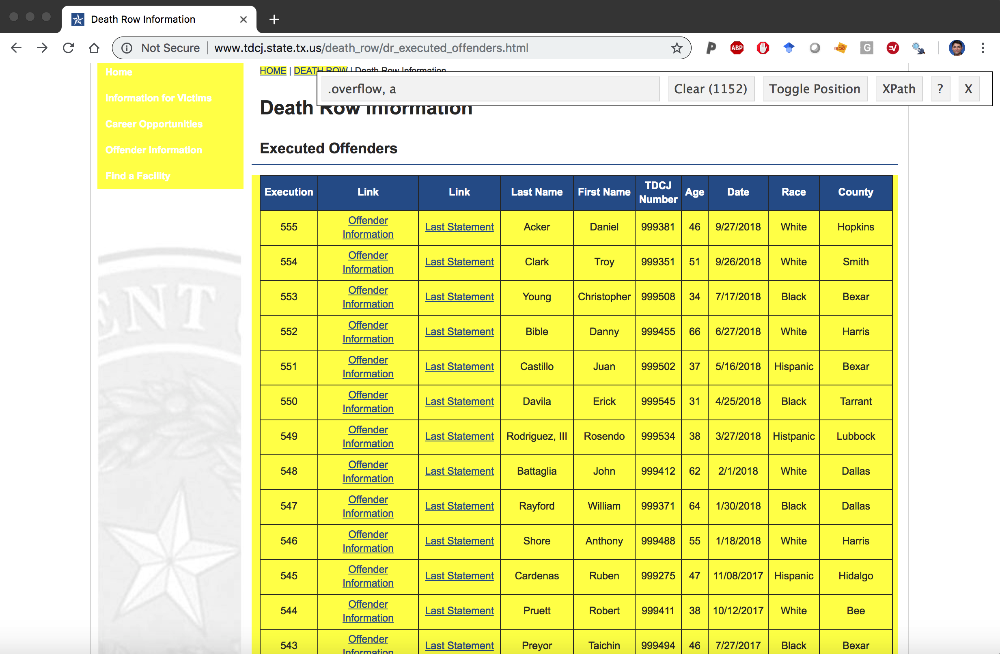
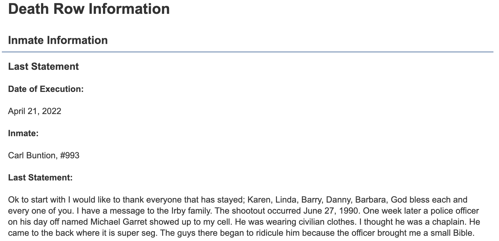
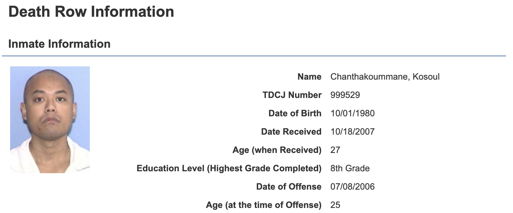
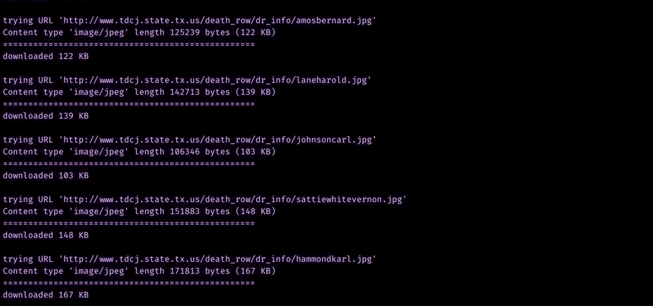

<style type="text/css">

.storyboard-nav .sbframelist {
margin: 0 auto;
width: 94%;
height: 50px;
overflow: hidden;
text-shadow: none;
margin-bottom: 8px;
}

.storyboard-nav .sbnext, .storyboard-nav .sbprev {
float: left;
width: 2%;
height: 50px;
font-size: 50px;
}

</style>

```{r setup, include = FALSE, message = FALSE}
library(jsonlite)  
library(tidyverse) 
library(xopen)     
library(knitr)     
library(xml2)
library(flexdashboard)
library(lubridate)
library(scales)
library(tidytext)
library(widyr)
library(ggrepel)
library(showtext)
library(patchwork)
library(hrbrthemes)
library(magick)
# install.packages("paletteer")
library(paletteer)
library(ggthemes)
knitr::opts_chunk$set(
  eval = FALSE,
  echo = TRUE,
  dev = "ragg_png",
  dpi = 320,
  out.width = "80%",
  fig.width = 6,
  fig.asp = 0.618,
  fig.retina = 2
  )
load("dmwt.rdata")
```

Background {.storyboard}
=========================================

### Executed Offenders Data {data-commentary-width=350}

This is a storyboard project using death-row data from the [Texas Department of Criminal Justice](https://www.tdcj.texas.gov/death_row/index.html), or TDCJ. 

TDCJ keeps keeps [records of every inmate they execute](https://www.tdcj.texas.gov/death_row/dr_executed_offenders.html).

In this project, I scrape the data from the HTML table, which contains some demographic information on each inmate. I use the [Selector Gadget](https://rvest.tidyverse.org/articles/selectorgadget.html) to locate and then build urls to the [info](https://www.tdcj.texas.gov/death_row/dr_info/chanthakoummanekosoul.html) and [last statement](https://www.tdcj.texas.gov/death_row/dr_info/buntioncarllast.html) for each inmate. 

With some help from the [`purrr` package](https://purrr.tidyverse.org/), I was able to download all of the `.jpg` images from the website. We perform some image manipulation with the [`magick` package.](https://cran.r-project.org/web/packages/magick/vignettes/intro.html) 


***

#### More Resources 

* [Executed Offenders](https://www.tdcj.texas.gov/death_row/dr_executed_offenders.html)
* [Inmates on Death Row](https://www.tdcj.texas.gov/death_row/dr_offenders_on_dr.html)
* [Scraping HTML Text](https://uc-r.github.io/scraping_HTML_text)

### Required Packages

HTML web-scraping packages

```{r web-pkgs}
library(rvest)     
library(jsonlite)  
library(xopen)     
library(xml2)
```

Data wrangling/processing packages

```{r data-pkgs}
library(dplyr)
library(tidyr)
library(janitor)
library(forcats)
library(lubridate)
library(stringr)
library(scales)
library(fs)
```

Graphs

```{r graph-pkgs}
library(paletteer)
library(ggthemes)
library(patchwork)
```


Shiny/dashboard packages 

```{r markdown-pkgs}
library(knitr)
library(flexdashboard)
library(gtsummary)
```

Image manipulation/processing

```{r imaage-pkgs}
library(grid)
library(magick)
library(ggpubr)
library(jpeg)
library(paletteer)
library(ggthemes)
library(patchwork)
library(ggrepel)
```


Import {.storyboard}
=========================================

### Scraping the table {data-commentary-width=450}

**Read HTML from URL**

Load the `xml2` package and define the url with the data (here it's `webpage_url`).

```{r webpage, eval=FALSE}
webpage_url <- "http://www.tdcj.state.tx.us/death_row/dr_executed_offenders.html"
webpage <- xml2::read_html(webpage_url)
```

**Exract HTML tables**

Use the `rvest::html_table()` to find the table in the `webpage` object. This is at position `[[1]]`.

```{r create-ExOffndrsRaw, eval=FALSE}
ExOffndrsRaw <- rvest::html_table(webpage)[[1]] 
```

```{r readr-ExOffndrsRaw, eval=TRUE, echo=FALSE}
# fs::dir_create("inst/extdata/")
# raw_inst_folder <- paste0("inst/extdata/", noquote(lubridate::today()), "/")
# fs::dir_create(
#     raw_inst_folder
#   )
# readr::write_rds(ExOffndrsRaw, paste0(raw_inst_folder, "ExOffndrsRaw.rds"))
# ExOffndrsRaw <- readr::read_rds(
#   file = "inst/extdata/2022-11-01/ExOffndrsRaw.rds")
```

The `dplyr::glimpse(40)` function is helpful here. 

```{r glimpse_table, eval=TRUE}
# check the data.frame
ExOffndrsRaw |> dplyr::glimpse(60)
```

**Fix the column names**

We can see the `Link` column is repeated, which is going to be a problem when we put these data into their own  `tibble` because R doesn't like to repeat the column names inside a `data.frame`. 

We will use the `tibble::as_tibble()` function, but add the `.name_repair = "unique"` argument. The `.name_repair` argument has other options (`"check_unique"`, `"unique"`, `"universal"` and `"minimal"`), and you can read the help files using `?as_tibble`. 

In this case, `"unique"` will work just fine. 

```{r ExecutedOffenders, message=FALSE, echo=TRUE, error=TRUE, eval=FALSE}
ExecutedOffenders <- rvest::html_table(webpage)[[1]] |> 
  # repair the repeated columns
  tibble::as_tibble(.name_repair = "unique") |> 
  # get unique names
  janitor::clean_names(case = "snake") |> 
  # lower, snake case
  dplyr::rename(offender_info = link_2, 
                # rename these 
                last_statement = link_3)
```

```{r readr-ExecutedOffenders, eval=TRUE, echo=FALSE}
# readr::write_rds(ExecutedOffenders, 
#   paste0(raw_inst_folder, "ExecutedOffenders.rds"))
# ExecutedOffenders <- readr::read_rds(
#   file = "inst/extdata/2022-11-01/ExecutedOffenders.rds")
```

```{r glimpse-ExecutedOffenders, eval=TRUE}
ExecutedOffenders |> glimpse(60)
```


***

The executed offenders table:

```{r ex_offndrs.png, out.width = "100%", echo=FALSE, eval=TRUE}

```

### Wrangle {data-commentary-width=450}

**Identify the links with selector gadget**

In order to get the `nodes` from the table, we need to send `webpage` through a few passes of `rvest` functions (`html_nodes` and `html_attr`) with various `css` tags to get the correct URL paths. This took a few tries and some trial and error, but eventually I was able to figure out the the correct combinations to get the `Links` to the pages.

```{r Links, eval=FALSE}
Links <- webpage |> 
  # this get the links in the overflow table 
  # row
  rvest::html_nodes(".overflow tr") |> 
  # the links
  rvest::html_nodes("a") |> 
  # the header ref
  rvest::html_attr("href")
```

```{r import-links, echo=FALSE, eval=TRUE}
# readr::write_rds(Links, file = "inst/extdata/2022-11-01/Links.rds")
# Links <- readr::read_rds("inst/extdata/2022-11-01/Links.rds")
```

```{r check-links, eval=TRUE}
# check Links
Links |> utils::head(20)
```

Now `Links` contain:

1) A `dr_info/` path (which makes the entire path `"http://www.tdcj.state.tx.us/death_row/dr_info/"`). 

2) Every offender has two links--one with their full name, the other with a `last` string attached to the back of their full name. 

Something tells me if I check the `base::length()` of `Links` with the `base::nrow()`s in `ExOffndrs`...there will be twice as many links as rows in executed offenders. 

```{r length_vs_nrow, eval=TRUE}
length(Links)
nrow(ExecutedOffenders)
```

Good--this is what I want. That means each row in `ExecutedOffenders` has two links associated with their name.

**Create `last_links` statements**

The `stringr` package can help me wrangle this long vector into the `last_pattern` logical vector, which I then use to subset the `Links`.

```{r last_pattern, eval=TRUE}
last_pattern <- stringr::str_detect(
                            string = Links, 
                            pattern = "last")
utils::head(Links[last_pattern])
```

Check to see that `Links[last_pattern]` is same length as the number of rows in `ExecutedOffenders`...

```{r identical_last_pattern_ExOffndrs, eval=TRUE}
base::identical(
  x = base::length(Links[last_pattern]), 
  y = base::nrow(ExecutedOffenders))
```

Great--subset the `Links` for the `last_pattern`, then give this vector a name (`last_links`). 

```{r last_links, eval=TRUE}
last_links <- Links[last_pattern]
last_links |> utils::head(10)
```

If I check the length of items in `last_links`, I can see there are an identical number of rows in the data frame. 

```{r check_lengths, eval=TRUE}
base::identical(
  x = base::length(last_links),
  y = base::nrow(ExecutedOffenders))
```

**Assign the `last_url` column to `ExecutedOffenders`**

This means I can easily assign these as a new column in `ExecutedOffenders`.

```{r add_last_links, eval=TRUE}
ExecutedOffenders |> glimpse(40)
```

Not done yet--I need to add the beginning of the web address:

`https://www.tdcj.texas.gov/death_row/`

```{r mutate_last_url, eval=TRUE}
# test 
ExecutedOffenders |> 
  dplyr::mutate(
    last_url = 
        paste0("https://www.tdcj.texas.gov/death_row/", 
                                  last_links)) |> 
  dplyr::pull(last_url) |> 
  utils::head(10) |> 
  base::writeLines()
# assign
ExecutedOffenders <- ExecutedOffenders |> 
  dplyr::mutate(
    last_url = 
        paste0("https://www.tdcj.texas.gov/death_row/", 
                                  last_links))
```

Now we will tidy these up into nice, clean `LastUrl` tibble.

```{r tidy-last-links, echo=TRUE, eval=TRUE}
LastUrl <- last_links |> 
  
  tibble::as_tibble(.name_repair = 
                          "unique") |> 
  
  tidyr::gather(key = "key",
                value = "value") |> 
  
  dplyr::select(name_last_url = value) |> 
  
  dplyr::mutate(name_last_url = 
        paste0("https://www.tdcj.texas.gov/death_row/", 
                                  last_links))

LastUrl$name_last_url |> 
  utils::head() |> 
  base::writeLines()
```

Test one of the URLs out in the browser. 

```{r open-death-row-html, eval=FALSE}
xopen("https://www.tdcj.texas.gov/death_row/dr_info/swearingenlarrylast.html")
```

**Create the info pattern**

Now I want the offender information links (so I omit the links with `last` in the pattern).

```{r info_pattern, eval=TRUE}
info_pattern <- !stringr::str_detect(
                            string = Links, 
                            pattern = "last")
Links[info_pattern] |> 
  utils::head() |> 
  base::writeLines()
```

**Verify length and rows**

Check the `base::length()` to see if it's identical to the number of rows in `ExecutedOffenders`.

```{r identical_info_pattern_ExOffndrs, eval=TRUE}
base::identical(x = base::length(Links[info_pattern]), 
                y = base::nrow(ExecutedOffenders))
```

Great!

Check the `length()` of `info_links`

```{r info_links, eval=TRUE}
info_links <- Links[info_pattern]
base::identical(x = base::length(info_links),
                y = base::nrow(ExecutedOffenders))
```

These are also identical. Repeat the URL process from above on the `info_url`

**Create `info_url` column**

Now we combine this with the `https://www.tdcj.texas.gov/death_row/` URL.

```{r create-info_url-death_row, eval=TRUE}
ExecutedOffenders |> 
  dplyr::mutate(
    info_url = 
        paste0("https://www.tdcj.texas.gov/death_row/", 
                                  info_links)) |> 
  dplyr::pull(last_url) |> 
  utils::head(10) |> 
  base::writeLines()
# assign
ExecutedOffenders <- ExecutedOffenders |> 
  dplyr::mutate(
    info_url = 
        paste0("http://www.tdcj.state.tx.us/death_row/", 
                                  info_links))
```

These are complete URLs--assign this to `ExecutedOffenders` data frame. Put the `InfoLinks` into a tidy data frame. 

```{r info_links-no-eval, eval=TRUE}
info_links <- Links[info_pattern]

InfoLinks <- info_links |> 
  # turn into a tibble
  tibble::as_tibble(.name_repair = "unique") |> 
  # tidy
  tidyr::gather(key = "key",
                value = "value") |> 
  # rename the value
  dplyr::select(dr_info_url = value) |> 
  # create the new url with death row root
  dplyr::mutate(
    dr_info_url = paste0(
                    "http://www.tdcj.state.tx.us/death_row/", 
                    info_links))
```

```{r view_InfoLinks, eval=TRUE}
InfoLinks |> dplyr::glimpse(60)
```

**Check in browser**

Test a few of these out in the browser:

```{r xopen-test, eval=FALSE}
xopen("http://www.tdcj.state.tx.us/death_row/dr_info/brookscharlie.html")
```

Now we assign these links to the `ExecutedOffenders` data frame. But first make sure they match up.

```{r check_names_in_ExOffndrs, eval=TRUE}
ExecutedOffenders |> 
  dplyr::select(last_name, 
                first_name) |>
  utils::head(10)
```

```{r check_last_names_in_ExOffndrs, eval=TRUE}
ExecutedOffenders |> 
  dplyr::select(last_name, 
                first_name) |>
  utils::tail(10)
```

**Bind columns**

Combine the `ExecutedOffenders`, `LastUrl` and `InfoLinks`. 

```{r bind_cols_ExOffndrsComplete, eval=TRUE}
# Use `dplyr::bind_cols()` to attach these columns 
# to `ExecutedOffenders` and rename to`ExOffndrsComplete`
ExecutedOffenders <- ExecutedOffenders |> 
  # add the info_url
  dplyr::bind_cols(LastUrl) |>
  # add the
  dplyr::bind_cols(InfoLinks) |>
  # move the names to the front
  dplyr::select(dplyr::ends_with("name"),
                # all else
                dplyr::everything())

```


```{r glimpse_ExecutedOffenders, eval=TRUE}
ExecutedOffenders |> dplyr::glimpse(60)
```


**Create indicator for .html vs .jpgs**

Create a binary variable to identify if this is a `.jpg` or `.html` path and name the new data frame `ExOffndrsComplete`.

**Use `case_when()` to create `jpg_html`**

```{r jpg_html, eval=TRUE}
ExOffndrsComplete <- ExecutedOffenders |> 
  dplyr::mutate(jpg_html = 
    dplyr::case_when(
      str_detect(string = info_url, pattern = ".jpg") ~ "jpg", 
      str_detect(string = info_url, pattern = ".html") ~ "html")) 
```

```{r count-jpg_html-ExOffndrsComplete, eval=TRUE}
ExOffndrsComplete |> dplyr::count(jpg_html)
```


***

##### Selector Gadget

Download the [selector gadget app](https://selectorgadget.com/) for your browser. You can identify the various elements in a webpage using the selector gadget. Read [this tutorial](https://rvest.tidyverse.org/articles/articles/selectorgadget.html) to see how it works. 

```{r selector_gadget, out.width = "100%", echo=FALSE, eval=TRUE}

```

Use the selector gadget to locate the css tags for `overflow, a`

##### Last statement url

Check the last statement for inmate [Carl Buntion, #993](https://www.tdcj.texas.gov/death_row/dr_info/buntioncarllast.html)

```{r last_statement, out.width = "100%", echo=FALSE, eval=TRUE}

```

##### Info url 

Check out the info url inmate  [Kosoul Chanthakoummane, #999529](https://www.tdcj.texas.gov/death_row/dr_info/chanthakoummanekosoul.html)

```{r info_url, out.width = "100%", echo=FALSE, eval=TRUE}

```


### Downloading images {data-commentary-width=350}


Now that we've downloaded the table of executed offenders from the [Texas Department of Criminal Justice website](http://www.tdcj.state.tx.us/death_row/dr_executed_offenders.html) and rebuilt the URLs to their last statements and info, we are going to download the mugshots that are stored as `.jpgs`.

```{r review-ExOffndrsComplete, eval=TRUE}
ExOffndrsComplete |> dplyr::glimpse(60)
```

**`purrr` and iteration**

We will use `purrr`s iteration tools to download the images attached to the website profiles. Follow the three `purrr` steps from the workshop by [Charlotte Wickham](https://www.rstudio.com/resources/rstudioconf-2017/happy-r-users-purrr-tutorial-/). See the accompanying 
[slides, too](https://github.com/cwickham/purrr-tutorial/blob/master/slides_with_transitions.pdf).

We'll go over these steps below:

***`purrr` 1) Do 'it' for one element***

First we need a test image (`test_image`) from the `jpg_html` column:

```{r test_image, echo=TRUE, eval=TRUE}
test_image <- ExOffndrsComplete |> 
  # only jpg row
  dplyr::filter(jpg_html == "jpg") |> 
  # pull the info url column
  dplyr::select(info_url) |> 
  # sample 1
  dplyr::sample_n(size = 1) |> 
  # convert to character 
  base::as.character() 
```

We can test the new url columns in the `ExecOffenders` with the `magick::image_read()` function. 

```{r test-image_read, eval=FALSE}
# pass test_image to image_read()
magick::image_read(test_image)
```

You should see an image in the RStudio viewer pane

**2. Turn 'it' into a recipe**

Use `dplyr::filter` to select only the `.jpgs` in the `ExOffndrsComplete` and create  `ExOffndrsCompleteJpgs`. 

Pull the urls into a vector (`jpg_url`), then create a folder to download them into (`jpg_path`).

```{r jpg_url}
ExOffndrsCompleteJpgs <- ExOffndrsComplete |> 
  dplyr::filter(jpg_html == "jpg") 
jpg_url <- ExOffndrsCompleteJpgs$info_url
fs::dir_create("inst/extdata/jpgs/")
jpg_path <- paste0("inst/extdata/jpgs/", base::basename(jpg_url))
jpg_path |> utils::head()
```

**3. Use `purrr::purrr::walk2()` to download all files**

Now use the `purrr::walk2()` function to download the files. How does `walk2` work?

First look at the arguments for `utils::download.file()`.

```{r args, eval=FALSE}
?utils::download.file
```

**How to `walk2()`** 
 
The help files tell us the `walk2` function is "*specialized for the two argument case*". So `.x` and `.y` become the two arguments we need to iterate over `download.file()`. We will walk through this step-by-step below:

1) `.x` = the file path, which we created with the selector gadget above (in `jpg_url`)

2) `.y` = the location we want the files to end up (`jpg_path`), and

3) the function we want to iterate over `.x` and `.y` (`download.file`).

When we pass everything to `purrr::walk2`, R will go to the URL, download the file located at the URL, and put it in the associated `jpgs/` folder.

**Download `.jpg` files**

Execute the code below and you will see the .jpgs downloading into the `jpg` folder.

```{r walk2, eval=FALSE}
purrr::walk2(.x = jpg_url, 
             .y = jpg_path, 
             .f = download.file)
```

You should see the following in your console.

You  will see text similar to the content below.

```r
# trying URL 'http://www.tdcj.state.tx.us/death_row/dr_info/robisonlarry.jpg'
# Content type 'image/jpeg' length 108341 bytes (105 KB)
# ==================================================
# downloaded 105 KB
# 
# trying URL 'http://www.tdcj.state.tx.us/death_row/dr_info/hicksdavid.jpg'
# Content type 'image/jpeg' length 139150 bytes (135 KB)
# ==================================================
# downloaded 135 KB
```

This might take awhile, but when its done, check the number of files in this folder.

```{r check_jpg_download, eval=FALSE, echo=TRUE}
fs::dir_info("./inst/extdata/jpgs/") |> 
  tibble::as_tibble() |> 
  dplyr::arrange(desc(size)) |> 
  dplyr::select(path, type, size) |> 
  dplyr::glimpse(60)
# Rows: 381
# Columns: 3
# $ path <fs::path> "./inst/extdata/jpgs/riddlegranville.jpg…
# $ type <fct> file, file, file, file, file, file, file, fil…
# $ size <fs::bytes> 244K, 225K, 202K, 195K, 190K, 189K, 189…
```

There you have it! 381 images of downloaded offenders! 


***

<br>

##### **`magick::image_read()`**

You should see the `.jpg` file in the RStudio Viewer pane after running `magick::image_read()`

```{r magik_demo.png, out.width='100%', echo=FALSE, eval=TRUE}

```

<br><br>

##### **`purrr::walk2()`**

When downloading the `.jpg` files with `purrr::walk2()`, you should see this in your console:

```{r figure_1, out.width = "100%", echo=FALSE, eval=TRUE}

```


Data Description {.storyboard}
=========================================

### Executions by `age` and `race` {data-commentary-width=140}

<br>

```{r graphs-ExOffndrsComplete, eval=TRUE, echo=FALSE}
ExOffndrsComplete <- dplyr::mutate(.data = ExOffndrsComplete,
    date = lubridate::mdy(date),
    year = lubridate::year(date),
    yday = lubridate::yday(date),
    month = lubridate::month(date, label = TRUE),
    race = factor(race)
  )
```


**Executions by `age` and `race`**

```{r date, eval=TRUE, echo=FALSE}
ExOffndrsComplete |> 
  dplyr::select(age, race) |> 
  gtsummary::tbl_summary()
```

### Executions by `date` and `month` {data-commentary-width=140}

<br><br>

**Executions by `date` and `month`**

```{r race, eval=TRUE, echo=FALSE}
ExOffndrsComplete |> 
  dplyr::select(date, month) |> 
  gtsummary::tbl_summary()
```


Visualize {.storyboard}
=========================================
  
### Total executions {data-commentary-width=200}

```{r ex_race_by_year, eval=TRUE, echo=FALSE}
# TotalExecYear ----
TotalExecYear <- ExOffndrsComplete |>
  dplyr::count(year, sort = TRUE)
# ggp2_total_exec_year ----
ggp2_total_exec_year <- ggplot(data = TotalExecYear, 
  aes(x = factor(year),
    y = n)) +
  geom_col(aes(fill = n),
    position = "stack",
    show.legend = FALSE) +
  scale_x_discrete(
    breaks = c("1980",
    "1985", "1990", "1995",
    "2000", "2005", "2010",
    "2015", "2020")) +
  paletteer::scale_fill_paletteer_c("ggthemes::Red") +
  labs(
    title = "Total Executions in Texas",
    subtitle = paste0(
      "From ",
      min(ExOffndrsComplete$year, na.rm = TRUE),
      " to ",
      max(ExOffndrsComplete$year, na.rm = TRUE)
    ),
    x = "Year",
    y = "Executions"
  ) +
  theme_minimal(base_size = 7)
ggp2_total_exec_year
```

### Total executions by race {data-commentary-width=200}

**Executions by `race` and `year`**

```{r ggp2_race_year_cols, eval=TRUE, echo=FALSE}
# TotalExecRaceYear ----
TotalExecRaceYear <- ExOffndrsComplete %>%
  # remove 'Other'
  dplyr::filter(race != "Other") %>% 
  dplyr::group_by(race, year) %>% 
      dplyr::summarise(
            ex_race_by_year = sum(n())) %>% 
    dplyr::arrange(desc(ex_race_by_year)) %>% 
  dplyr::ungroup()
# ggp2_race_year_cols -----
ggp2_race_year_cols <- ggplot(data = TotalExecRaceYear, 
    aes(y = ex_race_by_year,
        x = year,
        fill = race)) +
  ggplot2::geom_col(aes(fill = race),
    size = 1.5, show.legend = FALSE) +
  ggplot2::scale_x_continuous(
    breaks = c(1980, 2000, 2015)) +
  ggplot2::scale_fill_manual(
    values = c("1980", "2000", "2015"), 
    breaks = c("1980", "2000", "2015")) +
  # ggplot2::scale_fill_manual(
  #   values = c("1980", "1990", "2000", "2010", "2020")) + 
  paletteer::scale_fill_paletteer_d(
    "ggthemes::wsj_dem_rep", direction = 1) +
  ggplot2::facet_wrap(. ~ race, ncol = 3, nrow = 1) +
  ggplot2::labs(
    title = "Total Executions in Texas by Race",
    subtitle = paste0("From ", 
      min(ExOffndrsComplete$year, na.rm = TRUE), " to ", 
      max(ExOffndrsComplete$year, na.rm = TRUE)),
    x = "Year", y = "Executions") +
  ggplot2::theme_minimal(base_size = 7)
ggp2_race_year_cols
```

### Peak Executions by Year and Race {data-commentary-width=200}

```{r ggp2_max_race_year_line, eval=TRUE, echo=FALSE}
# ByYearLabels -----
ByYearLabels <- ExOffndrsComplete %>%
  # remove 'Other'
  dplyr::filter(race != "Other") %>%
  dplyr::group_by(race, year) %>%
  dplyr::summarise(ex_race_by_year = sum(n())) %>%
  dplyr::arrange(desc(ex_race_by_year)) %>%
  dplyr::ungroup() |>
  dplyr::group_by(race) |>
  dplyr::slice_max(ex_race_by_year) |>
  dplyr::mutate(
    label = paste0(
      ex_race_by_year, 
      " ", race, 
      " executions in ", 
      year))
# MaxRaceYear ----
MaxRaceYear <- ExOffndrsComplete %>%
  # remove 'Other'
  dplyr::filter(race != "Other") %>%
  dplyr::group_by(race, year) %>%
  dplyr::summarise(ex_race_by_year = sum(n())) %>%
  dplyr::arrange(desc(ex_race_by_year)) %>%
  dplyr::ungroup()
# ggp2_max_race_year_line -----
ggp2_max_race_year_line <- ggplot(data = MaxRaceYear, 
  aes(x = year,
    y = ex_race_by_year)) +
  # add the lines
  ggplot2::geom_line(aes(color = race),
    size = 0.7,
    show.legend = FALSE) +
  ggrepel::geom_label_repel(
    data = ByYearLabels,
    aes(x = year,
      y = ex_race_by_year,
      label = label),
    color = "black",
    fill = "white",
    size = 1.4,
    show.legend = FALSE
  ) +
  ggplot2::scale_color_manual(
    values = c("1980", "1990", "2000", "2010", "2020")) +
  paletteer::scale_color_paletteer_d(
    "ggthemes::wsj_dem_rep", direction = 1) +
  ggplot2::labs(
    title = "Peak Executions by Year and Race",
    subtitle = paste0("From ",
      min(ExOffndrsComplete$year, na.rm = TRUE),
      " to ",
      max(ExOffndrsComplete$year, na.rm = TRUE)),
    caption = "Data from Texas Department of Criminal Justice",
    x = "Year",
    y = "Executions") +
  ggplot2::theme_minimal(base_size = 7)
ggp2_max_race_year_line
```

### All {data-commentary-width=200}

```{r patchwork, eval=TRUE, echo=FALSE}
# ggp2_max_race_year_line
ggp2_total_exec_year / (ggp2_race_year_cols |
    ggp2_max_race_year_line) +
  patchwork::plot_layout(nrow = 2)
```


Images {.storyboard}
=========================================

### Magick {data-commentary-width=450}

I used the [magik](https://cran.r-project.org/web/packages/magick/vignettes/intro.html) package for processing and manipulating the mugshot images. I advise checking out the entire vignette for more examples. 

**Create test image**

The executed offender we'll include in the plot is [Billy Joe Woods](https://www.nytimes.com/1997/04/15/us/after-21-year-wait-texas-executes-man.html) from Waller County, Texas. He was executed on April 14th, 1997. The LA Times covered this case in an article titled, [Executions in Texas: No Big Deal](https://www.latimes.com/archives/la-xpm-1997-05-20-mn-60637-story.html). 

> "*At this rate, with 12 executions already, 1997 is expected to become the busiest year ever on Texas’ death row--or any other state’s, for that matter--surpassing the previous record of 19, set here in 1995. If and when that happens--most likely next month--it could very well reignite the debate over capital punishment across the nation, inspiring activists on both sides of the issue alternately to hail and condemn the milestone.*"

I create `test_magick_img` from `magick::image_read()`, and then go on making the transformations as necessary. 

```{r permanent-test_image, echo=TRUE, include=TRUE}
"https://www.tdcj.texas.gov/death_row/dr_info/woodsbillyjoe.jpg" -> test_image
```

```{r test_magick_img, eval=FALSE}
test_magick_img <- magick::image_read(test_image)
```

To remove the text and focus on the mugshot. This might need to be adjusted slightly for each new `test_magick_img`.

```{r crop_750_1000_10, eval=FALSE}
# crop this image
crop_750_1000_10 <- magick::image_crop(
  image = test_magick_img,
  geometry = "750x1000+10"
)
```

This trims the extra space off the bottom of the image. 

**Rotate with `magick::image_rotate()`**

I want to rotate this image by 90 degrees. 

```{r crop_750_1000_10_rotate90, eval=FALSE}
# rotate this image
crop_750_1000_10_rotate90 <- magick::image_rotate(
  crop_750_1000_10,
  degrees = 90
)
```

Remove the rest of the text and focus on the mugshot. *This might need to be adjusted slightly for each new image*

```{r crop_850_950_60, eval=FALSE}
# crop this image
crop_850_950_60 <- magick::image_crop(
  image = crop_750_1000_10_rotate90,
  geometry = "850x950+60"
)
```

Rotate this image back to center (`image_rotate` again) and flip it using `magick::image_flip()`

```{r test_magick_rotate270, eval=FALSE}
# rotate this image
crop_850_950_60_rotate270 <- magick::image_rotate(
  crop_850_950_60,
  degrees = 270)
# rotate this image
crop_850_950_60_flip <- magick::image_flip(crop_850_950_60_rotate270)
```

Crop the rest of the text out of the image, trim the white-space for the plot, and flip the image. 

```{r crop_750_255_300, eval=FALSE}
# crop this image
crop_750_255_300 <- magick::image_crop(
  image = crop_850_950_60_flip,
  geometry = "750x255+300"
)
# flip this image again
crop_850_950_60_flip <- magick::image_flip(crop_750_255_300)
```

Crop out the last little bit of the document. 

```{r crop_435_352_1, eval=FALSE}
# crop the dot out
crop_435_352_1 <- magick::image_crop(
  image = crop_850_950_60_flip,
  geometry = "435x352+1"
)
```

**Image effects with `magick`**

We will use `magick::image_trim()` to clean the image up a bit. 

```{r test_magick_clean, eval=FALSE}
# Here we will trim the image up a bit with the `fuzz` argument
test_magick_clean <- magick::image_trim(
  image = crop_435_352_1,
  fuzz = 1
)
```

Now that I have all the trimming on and cropping done, I will add some effects for the `ggplot2` image. 

I want the image to have a bit more contrast, so I will use `magick::image_contrast()` to create these effects. 

```{r test_magick_final}
test_magick_final <- magick::image_contrast(image = test_magick_clean, 
  sharpen = TRUE 
)
```

**Export `.jpg`**

Export the image as a `.jpg`

```{r export-test_magick_final, eval=FALSE}
magick::image_write(test_magick_final,
        path = "www/test_magick_final.jpg")
```


***

If we print `test_magick_img` to the console, the images comes up in the viewer pane.

**Original image**

```{r test_magick_img-1-png, echo=FALSE, fig.align='center', out.width='100%', eval=TRUE}
knitr::include_graphics(path = "www/test_magick_img-1.png")
```

**Final image**

```{r test_magick_final-1-png, echo=FALSE, fig.align='center', out.width='100%', eval=TRUE}
knitr::include_graphics(path = "www/test_magick_final-1.png")
```

### Graph with image {data-commentary-width=450}

I create `TotalExecYear` as the data for the image to appear on top of.

```{r TotalExecYear, eval=TRUE}
TotalExecYear <- ExOffndrsComplete |>
  dplyr::count(year, sort = TRUE)
head(TotalExecYear)
```

**Import `.jpg`**

```{r imgJPEG, eval=TRUE}
library(jpeg)
imgJPEG <- jpeg::readJPEG("www/test_magick_final.jpg")
```

**Build labels**

```{r labs_bjw, eval=TRUE}
labs_bjw <- labs(
  title = "Billy Joe Woods was the twelfth execution in Texas in 1997",
  subtitle = "1997 is expected to become the busiest year ever on Texas’ death row",
  caption = "https://www.latimes.com/archives/la-xpm-1997-05-20-mn-60637-story.html",
  x = "Year",
  y = "Total Executions"
)
```

Build a base plot 

```{r ggp2_bjw_base, eval=TRUE}
ggp2_bjw_base <- ggplot(
  data = TotalExecYear, 
  aes(x = factor(year),
    y = n)) 
```

Create `background_image()` with `ggpubr` 

```{r , eval=TRUE}
ggp2_bjw_bg_img <- ggpubr::background_image(imgJPEG) 
```

Create column graph

```{r ggp2_bjw_col, eval=TRUE}
ggp2_bjw_col <- geom_col(aes(fill = n),
  position = "stack",
  show.legend = FALSE) 
```

Build `x` scale
 
```{r ggp2_bjw_x_discrete, eval=TRUE}
ggp2_bjw_x_discrete <- scale_x_discrete(
    breaks = c("1980","1985", "1990", "1995",
    "2000", "2005", "2010", "2015", "2020"))
```

Set colors with `paletteer`

```{r ggp2_bjw_fill_pal, eval=TRUE}
ggp2_bjw_fill_pal <- paletteer::scale_fill_paletteer_c("ggthemes::Red") 
```

**Add labels using `ggrepel`**

We also want to label the specific point on the graph where Billy Joe Woods was executed. We can do this by filtering the `ExecOffenders` to only his row in that dataset, then creating a `label` variable with `paste0()`. We now want to limit the columns in `ExecOffLabel` to *only those values* on the graph, which are `year`, `n`,  and `label`

```{r ExecOffLabel, eval=TRUE}
ExecOffLabel <- ExOffndrsComplete %>% 
  filter(last_name == "Woods" & first_name == "Billy") %>%
  mutate(
    year = factor(year),
    label = paste0(last_name, ", ", first_name, ": executed on ", date),
    n = 12) %>% 
  select(year, n, label)
ExecOffLabel
```

We will add the `geom_label_repel()` layer with `ExecOffLabelData` and increase the `size` of the label so it stands out. 

```{r ggp2_bjw_lab_repel, eval=TRUE}
ggp2_bjw_lab_repel <- ggrepel::geom_label_repel(
  data = ExecOffLabel,
      aes(x = year,
          y = n,
          label = label),
          # set color and size...
          color = "black",
          size = 2) 
```

***

**Build plot**

```{r base_plot, eval=TRUE, fig.align='center', out.height='100%', out.width='100%'}
ggp2_bjw_base + 
  ggp2_bjw_bg_img + 
  ggp2_bjw_col + 
  ggp2_bjw_x_discrete +
  ggp2_bjw_fill_pal +
  labs_bjw +
  theme_minimal()
```

**Add labels**

```{r add_ggp2_bjw_lab_repel, eval=TRUE, fig.align='center', out.width='100%', out.height='100%'}
ggp2_bjw_base + 
  ggp2_bjw_bg_img + 
  ggp2_bjw_col + 
  ggp2_bjw_lab_repel +
  ggp2_bjw_x_discrete +
  ggp2_bjw_fill_pal +
  labs_bjw +
  ggpubr::theme_pubclean()
```


<!--
### Tensorflow {data-commentary-width=350}

***

Installation

### Keras Tensorflow {data-commentary-width=350}

```{r}

```

***


Installation

```{r}

```

-->

Summary 
=========================================

Row
-------------------------------------
    
### Key findings

#### Overall    

#### Themes    

#### Discussion


  

Row
-------------------------------------
### Future work 

### Applications


### Acknowledgements 

* [link]()
* [link]()
