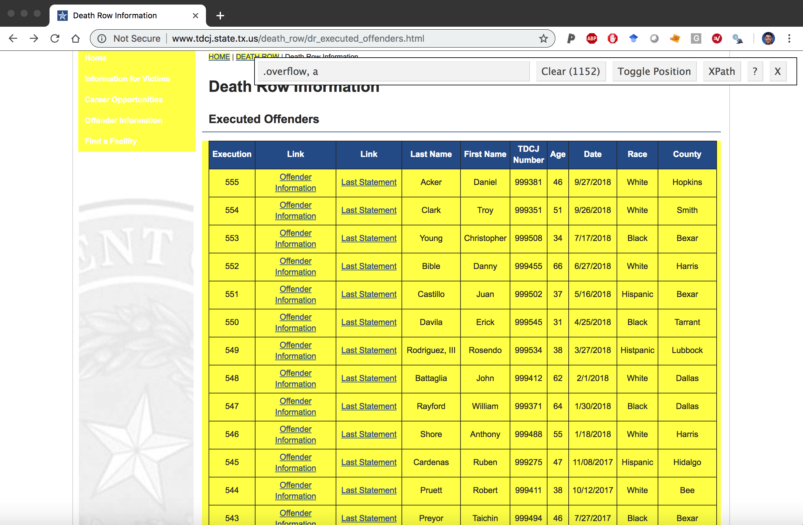

```{r setup, include = FALSE}
library(tidyverse)
library(skimr)
library(lubridate)
library(here)
library(janitor)
library(socviz)
library(ggrepel)
library(showtext)
library(hrbrthemes)
# create data folder
knitr::opts_chunk$set(warning = FALSE,
                      message = FALSE,
                      fig.path = "../results/figures/",
                      eval = FALSE,
                      collapse = TRUE,
                      comment = "# ",
                      tidy = FALSE)
# knitr::opts_knit$set(root.dir = '/Users/mjfrigaard/Dropbox/@projects/high-priority/@apps/dmwt/')
# set width
options(width = 60, max.print = 300)
```

```{r pkg, eval=FALSE}
library(dmwt)
```


## Texas death row executed offenders website

Texas Department of Criminal Justice keeps records of every inmate they execute. We're going to scrape the data found [here](http://www.tdcj.state.tx.us/death_row/dr_executed_offenders.html).

```{r packages, message=FALSE, warning=FALSE}
library(rvest)     
library(jsonlite)  
library(tidyverse) 
library(xopen)     
library(knitr)     
library(xml2)
```


## Scraping the data from HTML websites 

Define the url with the data (here it's `webpage_url`) and read it into R with `xml2::read_html()`

```{r webpage, eval=FALSE}
webpage_url <- "http://www.tdcj.state.tx.us/death_row/dr_executed_offenders.html"
webpage <- xml2::read_html(webpage_url)
```

### Exracting HTML tables

Use the `rvest::html_table()` to find the table in the `webpage` object. This is at position `[[1]]`.

The `dplyr::glimpse(78)` function is helpful here. 

```{r create-ExOffndrsRaw, eval=FALSE}
ExOffndrsRaw <- rvest::html_table(webpage)[[1]] 
```

Export these data, the read the export back into RStudio.

```{r readr-ExOffndrsRaw, eval=FALSE}
raw_inst_path <-  paste0("data/raw/", 
                          noquote(lubridate::today()), 
                          "-ExOffndrsRaw.rds")
readr::write_rds(ExOffndrsRaw, raw_inst_path)
```

**Since we don't want to scrape the data every time we run this vignette, we'll import the latest download**.

```{r re-read-ExOffndrsRaw, eval=TRUE}
ExOffndrsRaw <- readr::read_rds(
  file = "../data/raw/2022-11-21-ExOffndrsRaw.rds")
```

```{r glimpse_table, eval=TRUE}
# check the data.frame
ExOffndrsRaw |> dplyr::glimpse(78)
```

### Fix the column names

We can see the `Link` column is repeated, which is going to be a problem when we put these data into their own  `tibble` because R doesn't like to repeat the column names inside a `data.frame`. 

We will use the `tibble::as_tibble()` function, but add the `.name_repair = "unique"` argument. The `.name_repair` argument has other options (`"check_unique"`, `"unique"`, `"universal"` and `"minimal"`), and you can read the help files using `?as_tibble`. 

In this case, `"unique"` will work just fine. 

```{r ExecutedOffenders, message=FALSE, echo=TRUE, error=TRUE, eval=FALSE}
ExecutedOffenders <- rvest::html_table(webpage)[[1]] |> 
  # repair the repeated columns
  tibble::as_tibble(.name_repair = "unique") |> 
  # get unique names
  janitor::clean_names(case = "snake") |> 
  # lower, snake case
  dplyr::rename(offender_info = link_2, 
                # rename these 
                last_statement = link_3)
```

We'll store this in the data/ folder (because it's been altered), but make sure we have a sub-folder for the date. 

```{r export-ExecutedOffenders, eval=FALSE}
data_path <- paste0("../data/", noquote(lubridate::today()), "/")
fs::dir_create(data_path)
data_file_path <- paste0(data_path, "ExecutedOffenders.rds")
readr::write_rds(ExecutedOffenders, data_file_path)
```

```{r , eval=TRUE}
fs::dir_tree("../data/", regexp = "2022-11-21")
```

Read the `2022-11-21` data back into RStudio: 

```{r re-read-ExecutedOffenders, eval=TRUE}
ExecutedOffenders <- readr::read_rds(
  file = "../data/2022-11-21/ExecutedOffenders.rds")
```

```{r glimpse-ExecutedOffenders, eval=TRUE}
ExecutedOffenders |> glimpse(78)
```


### `scrape_death_row()`

```{r scrape_death_row, eval=FALSE}
scrape_death_row <- function() {
  webpage_url <- "http://www.tdcj.state.tx.us/death_row/dr_executed_offenders.html"
  webpage <- xml2::read_html(webpage_url)
  ExOffndrsRaw <- rvest::html_table(webpage)[[1]] 
  ExOffndrsTbl <- tibble::as_tibble(x = ExOffndrsRaw, .name_repair = "unique")
  ExOffndrsNms <- janitor::clean_names(dat = ExOffndrsTbl, case = "snake") 
  ExecutedOffenders <- purrr::set_names(x = ExOffndrsNms, 
                          nm = c("execution", "offender_info", "last_statement", 
                                "last_name", "first_name", "tdcj_number", 
                                "age", "date", "race", "county"))
  return(ExecutedOffenders)
}
```

## Identify the links with selector gadget 

Download the [selector gadget app](https://selectorgadget.com/) for your browser. 

### Using the selector gadget

You can identify the various elements in a webpage using the selector gadget. Read [this tutorial](https://rvest.tidyverse.org/articles/articles/selectorgadget.html) to see how it works. 


```{r selector_gadget, out.width='70%', echo=FALSE, eval=TRUE}

```

In order to get the `nodes` from the table, we need to send `webpage` through a few passes of `rvest` functions (`html_nodes` and `html_attr`) with various `css` tags to get the correct URL paths. This took a few tries and some trial and error, but eventually I was able to figure out the the correct combinations to get the `Links` to the pages.

```{r Links}
Links <- webpage |> 
  # this get the links in the overflow table 
  # row
  rvest::html_nodes(".overflow tr") |> 
  # the links
  rvest::html_nodes("a") |> 
  # the header ref
  rvest::html_attr("href")
```

```{r import-Links}
data_path <- paste0("../data/", noquote(lubridate::today()), "/")
fs::dir_create(data_path)
links_file_path <- paste0(data_path, "Links.rds")
readr::write_rds(Links, links_file_path)
```

```{r , eval=TRUE}
fs::dir_tree("../data/", regexp = "2022-11-21")
```

```{r re-read-Links, eval=TRUE}
Links <- readr::read_rds("../data/2022-11-21/Links.rds")
```

```{r check-links}
# check Links
Links |> utils::head(20)
```


Now `Links` contain:

1) A `dr_info/` path (which makes the entire path `"http://www.tdcj.state.tx.us/death_row/dr_info/"`). 

2) Every offender has two links--one with their full name, the other with a `last` string attached to the back of their full name. 

Something tells me if I check the `base::length()` of `Links` with the `base::nrow()`s in `ExOffndrs`...there will be twice as many links as rows in executed offenders. 

```{r length_vs_nrow}
length(Links)
nrow(ExecutedOffenders)
```

Good--this is what I want. That means each row in `ExecutedOffenders` has two links associated with their name.

### Create `last_links` statements

The `stringr` package can help me wrangle this long vector into the `last_pattern` logical vector, which I then use to subset the `Links`.

```{r last_pattern}
last_pattern <- stringr::str_detect(
                            string = Links, 
                            pattern = "last")
utils::head(Links[last_pattern])
```

Check to see that `Links[last_pattern]` is same length as the number of rows in `ExecutedOffenders`...

```{r identical_last_pattern_ExOffndrs}
base::identical(
  x = base::length(Links[last_pattern]), 
  y = base::nrow(ExecutedOffenders))
```

Great--subset the `Links` for the `last_pattern`, then give this vector a name (`last_links`). 

```{r last_links}
last_links <- Links[last_pattern]
last_links |> utils::head(10)
```

If I check the length of items in `last_links`, I can see there are an identical number of rows in the data frame. 

```{r check_lengths}
base::identical(x = base::length(last_links),
                y = base::nrow(ExecutedOffenders))
```

### Assign the `last_url` column to `ExecutedOffenders`

This means I can easily assign these as a new column in `ExecutedOffenders`.

```{r add_last_links}
ExecutedOffenders |> glimpse()
```

Not done yet--I need to add the beginning of the web address:

`https://www.tdcj.texas.gov/death_row/`

```{r mutate_last_url}
# test 
ExecutedOffenders |> 
  dplyr::mutate(
    last_url = 
        paste0("https://www.tdcj.texas.gov/death_row/", 
                                  last_links)) |> 
  dplyr::pull(last_url) |> 
  utils::head(10) |> 
  base::writeLines()
# assign
ExecutedOffenders <- ExecutedOffenders |> 
  dplyr::mutate(
    last_url = 
        paste0("https://www.tdcj.texas.gov/death_row/", 
                                  last_links))
```

Now we will tidy these up into nice, clean `LastUrl` tibble.


```{r tidy-last-links, echo=FALSE}
LastUrl <- last_links |> 
  tibble::as_tibble(.name_repair = 
                          "unique") |> 
  tidyr::pivot_longer(cols = value, 
    names_to = "key", 
    values_to = "value") |> 
  dplyr::select(name_last_url = value) |> 
  dplyr::mutate(name_last_url = 
        paste0("https://www.tdcj.texas.gov/death_row/", 
                                  last_links))
LastUrl$name_last_url |> 
  utils::head() |> 
  base::writeLines()
```

Test one of the URLs out in the browser. 

```{r open-death-row-html, eval=FALSE}
xopen("https://www.tdcj.texas.gov/death_row/dr_info/swearingenlarrylast.html")
```

## Create the info pattern 

Now I want the offender information links (so I omit the links with `last` in the pattern).

```{r info_pattern}
info_pattern <- !stringr::str_detect(
                            string = Links, 
                            pattern = "last")
Links[info_pattern] |> 
  utils::head() |> 
  base::writeLines()
```

### Verify length and rows

Check the `base::length()` to see if it's identical to the number of rows in `ExecutedOffenders`.

```{r identical_info_pattern_ExOffndrs}
base::identical(x = base::length(Links[info_pattern]), 
                y = base::nrow(ExecutedOffenders))
```

Great!

Check the `length()` of `info_links`

```{r info_links}
info_links <- Links[info_pattern]
base::identical(x = base::length(info_links),
                y = base::nrow(ExecutedOffenders))
```

These are also identical. Repeat the URL process from above on the `info_url`

### Create `info_url` column

Now we combine this with the `https://www.tdcj.texas.gov/death_row/` URL.

```{r create-info_url-death_row}
ExecutedOffenders |> 
  dplyr::mutate(
    info_url = 
        paste0("https://www.tdcj.texas.gov/death_row/", 
                                  info_links)) |> 
  dplyr::pull(last_url) |> 
  utils::head(10) |> 
  base::writeLines()
# assign
ExecutedOffenders <- ExecutedOffenders |> 
  dplyr::mutate(
    info_url = 
        paste0("http://www.tdcj.state.tx.us/death_row/", 
                                  info_links))
```

These are complete URLs--assign this to `ExecutedOffenders` data frame. Put the `InfoLinks` into a tidy data frame. 

```{r info_links-no-eval}
info_links <- Links[info_pattern]
InfoLinks <- info_links |> 
  # turn into a tibble
  tibble::as_tibble(.name_repair = "unique") |> 
  # tidy
  tidyr::pivot_longer(cols = value, 
                      names_to = "key", 
                      values_to = "value") |> 
  # rename the value
  dplyr::select(dr_info_url = value) |> 
  # create the new url with death row root
  dplyr::mutate(
    dr_info_url = paste0("http://www.tdcj.state.tx.us/death_row/", info_links))
```

```{r}
InfoLinks |> head()
```

### Check in browser 

Test a few of these out in the browser:

```{r xopen-test, eval=FALSE}
xopen("http://www.tdcj.state.tx.us/death_row/dr_info/chanthakoummanekosoul.html")
```

Now we assign these links to the `ExecutedOffenders` data frame. But first make sure they match up.

```{r check_names_in_ExOffndrs}
ExecutedOffenders |> 
  dplyr::select(last_name, 
                first_name) |>
  utils::head(10)
```

```{r check_last_names_in_ExOffndrs}
ExecutedOffenders |> 
  dplyr::select(last_name, 
                first_name) |>
  utils::tail(10)
```

### Bind columns

Combine the `ExecutedOffenders`, `LastUrl` and `InfoLinks`. 

```{r bind_cols_ExOffndrsComplete}
# Use `dplyr::bind_cols()` to attach these columns to `ExecutedOffenders` and 
# rename to`ExOffndrsComplete`
ExecutedOffenders <- ExecutedOffenders |> 
  # add the info_url
  dplyr::bind_cols(LastUrl) |>
  # add the
  dplyr::bind_cols(InfoLinks) |>
  # move the names to the front
  dplyr::select(dplyr::ends_with("name"),
                # all else
                dplyr::everything())

```


```{r}
ExecutedOffenders |> dplyr::glimpse(78)
```


## Create indicator for .html vs .jpgs 

Create a binary variable to identify if this is a `.jpg` or `.html` path and name the new data frame `ExOffndrsComplete`.

### Use `case_when()` to create `jpg_html`

```{r jpg_html}
ExOffndrsComplete <- ExecutedOffenders |> 
  dplyr::mutate(jpg_html = 
        dplyr::case_when(
          str_detect(string = info_url, pattern = ".jpg") ~ "jpg", 
          str_detect(string = info_url, pattern = ".html") ~ "html")) 
```

```{r}
ExOffndrsComplete |> dplyr::count(jpg_html)
```

## Export the data with a date stamp 

We now have a data frame we can export into a dated folder. 

### Export raw data 

```{r export-raw}
# create raw folder
fs::dir_create("../data/raw/")
raw_data_folder <- paste0("../data/raw/", noquote(lubridate::today()), "/")
fs::dir_create(
    raw_data_folder
  )
```

Create an exported data file (with the path) and write to `data-raw/`

```{r export-executed_raw_file}
# create export path
executed_csv_file <- paste0(raw_data_folder, "ExecutedOffenders.csv")
executed_raw_csv_file <- paste0(raw_data_folder, "RawExecutedOffenders.csv")
executed_complete_csv_file <- paste0(raw_data_folder, "ExecutedOffendersComplete.csv")
# export
vroom::vroom_write(x = ExecutedOffenders, file = executed_csv_file)
vroom::vroom_write(x = ExOffndrsRaw, file = executed_raw_csv_file)
vroom::vroom_write(x = ExOffndrsComplete, file = executed_complete_csv_file)
```


```{r tree-export-all, eval=TRUE}
# verify
fs::dir_tree("../data/raw/", recurse = TRUE)
```


